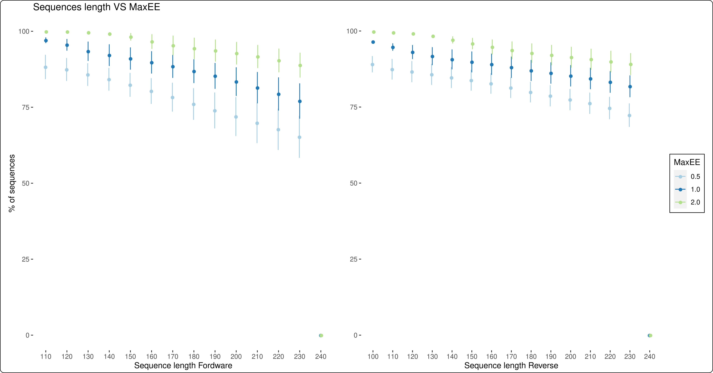
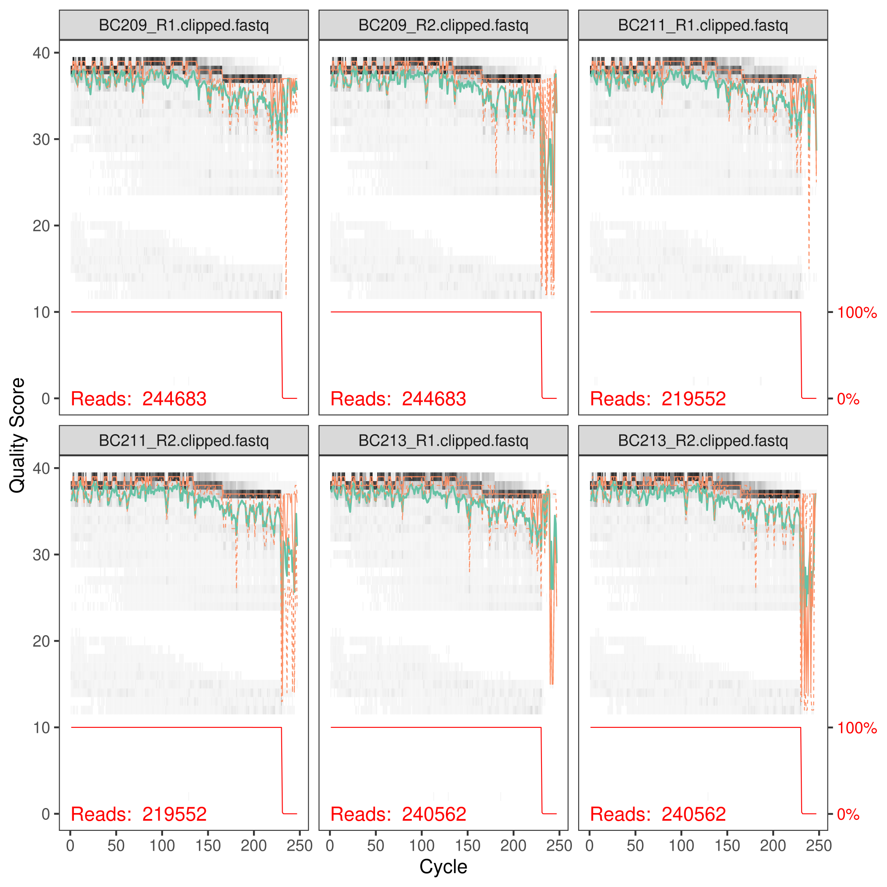

## µSudAqua[db]: a georeferenced rRNA amplicon database of aquatic microbiomes from South America 

### Summary
 The biogeography of bacterial communities is a key topic in Microbial Ecology. Regarding continental water, most studies are carried out in the northern hemisphere, leaving a gap on microorganism’s diversity patterns on a global scale. South America harbours approximatelly one third of the world's total fresh water resources, and is one of these understudied regions. To fill this gap, we compiled 16S rRNA amplicon sequencing data of microbial communities across South America continental water ecosystems, presenting the first database **µSudAqua[db]**. The database contains over 872 georeferenced samples from 9 different ecoregions with contextual environmental information. For its integration and validation we constructed a curated database (**µSudAqua[db.sp]**) using samples sequenced in Illumina MiSeq platform using the same prokaryote universal primers. This comprised ~60% of the total georeferenced samples of the **µSudAqua[db]**. This compilation was carried out in the scope of the µSudAqua collaborative network and represents one of the most complete databases of continental water microbial communities from South America.

***

### Structure:
 * Data availability
 * Data processing and integration:
 * Getting started
 * Prerequisites
 * Running
 * Acknowledge
 * Contribution
 * Publications

### Data Availability
 The data is avaliable at https://tinyurl.com/usudaqua:
 * Raw dataset **µSudAqua[db]**:
   * [Complete datasets compressed](suddb)
   * [Separated by eco-region](ecor)
 
 * Raw dataset **µSudAqua[db.sp]**: 
   * [Compressed files](suddb2)
   * [Separated by eco-region](ecor2)
   * [ASV table](asvt)
   * [Taxonomy annotation](tax)
   * [Multi-Fasta file](fasta)
 
  * [**Table 1:**](table1) Table detailing the metadata associated to the samples from the databases. Each sample was assigned to a geographical location, ecoregion and environmental type  (e.g. shallows and deep lakes, rivers, streams, reservoir, swamps).  Futhermore, we recovered the procedures adopted for sampling and sequencing. Public accession information  (i.e: bioproject, accession number, references, etc) of each sample are also showed.
  * [**Table 2:**](table2) µSudAqua[db.sp] database samples description by ecoregions. In all cases V3-V4 region of gen 16S rRNA was sequenced with illumina MiSeq using the primers 341F (`5'-CCTACGGGNGGCWGCAG-3'`) and 805R (`5'-GACT ACHVGGGTATCTAATCC-3'`).
  * [**Table 3:**](table3)  Overview of the technical validation from the µSudAqua[db.sp] database samples. Number of reads and ASVs resulting from the data processing. 

### Data processing and integration

 #### Getting Started
  The pipeline for processing the samples was implemented following the recomendations of [Benjamin Callahan](https://benjjneb.github.io/dada2/), for it usage under a **GNU-Linux OS** and/or in the [Pirayu cluster][Pirayu], which _Workload Manager_ is [**SLURM**](https://slurm.schedmd.com/).

 #### Prerequisites
  * Python 2.7+
  * R 3.5+
  * USEARCH 10+ 
  * DADA2 1.04+
  * Cutadapt 1.18+
  * Blast 2.5+

 #### Running

  Workflow to run the pipeline **EDNA v 1.0** using **GNU-Linux SO**, for that use the scripts that are in the folder [Scripts](scripts)
  1. Start a new project by the edition of the file **`make.new.project.sh`**:
     - Indicate the path to the directory where you want to create the new project (e.g. `~/Documents/`)
     - The name of the project (e.g. `MY_PROJECT`) 
     - The number of threads to use (e.g. `NCORES=4`)
     - and the primers used for sequencing (e.g, `PRIMERF="AYGTTG..." PRIMERR="TGGCY..."`).

  2. Execute the script:
     ```sh
     sh make.new.project.sh 
     ``` 

     This will create a new folder with the project name previously indicated. This folder will contain the next structure:
 
     ```sh
     MY PROJECT
      ├── 01-raw_data # folder for row data in fastq compressed [.zip|.gz|.tar.gz|etc]
      ├── 02-uncompressed # folder for row data in fastq uncompressed
      ├── 03-change_names # folder for files with new names
      ├── 04-clipping_primers # folder for primer clipping results
      │   └── clipped
      ├── 05-quality_control # folder for sample quality results
      │   └── successful
      ├── 06-dada2 # folder for dada2 results
      │   ├── control_files
      │   ├── pathF
      │   │   └── filtered
      │   └── pathR
      │   └── filtered
      └── 07-taxonomy # folder for final ASV table and taxonomy assignation
     ``` 
  3. Move your data to `01-raw_data`
     
     \* If the samples are compressed, decompress them in the `02-uncompressed` folder e.g:

     ```sh
     unzip e 01-raw_data/file.zip 02-uncompressed
     gunzip *.gz
     tar -zxvf *.tar.gz 
     ```
  4. Change samples names:
     * Modify the archive named `03-change_names/list_of_names.txt`
     * Execute the script `change.names.py`
     ```sh 
     sh change_names.sh
     ```
     \* If you don't want to changes the names of the samples, move all the files from `02-uncompressed` to `03-change_names` folder

  5. Extract the primers from the reads executing:

     ```sh
     sh clipping_primers.sh
     ```
  6. Analyze the samples quality:

     ```sh
     sh check_quality.sh
     ```

     \* This return two different figures, **Error_plot.pdf** (**Figure 1**) and **Quality_plots.pdf** (**Figure 2**). These are useful to define the parameters to be used in DADA2 pipeline. The **Figure 1** shows the percentaje of sequences that will pass according to the quality threshold (**MaxEE**) and the sequences lengths. The **Figure 2** shows the quality from the first three samples (the patterns will be similar for all the samples sequenced in the same run). 

     Moreover, in the folder `05-quality_control` you will find the **resume.txt** file (tab-separated table), with the min, mean and max length of the sequences, and at the last column if the sample fail the quality control (number of reads < 10K). This value can be modified in the script **resume_quality.py** [line 64].

     

     **Figure 1**: Error plots for the forward and reverse samples.
    
     
    
     **Figure 2**: Quality plots of the first three samples

  7. Run DADA2 pipeline: 
     - modify the filtering parameters from the `dada2.sh` script:

     * **maxEE1 and maxEE2** refered to the maxEE value to be used for filtering the sequences.
     
     * **trunc1 and trunc2** refered to the lenghts values used to trunc the sequences forward and reverse
     
     * **trunqQ** refered to the quality value used to exclude sequences of low quality

     \* For more information of this parameters visit the [DADA2 web page](https://benjjneb.github.io/dada2/index.html)
 
     - Execute the script dada2.slurm.sh:
 
     ```sh
     sh dada2.slurm.sh
     ```
  8. Remove chimeras and construct the final ASV table:
     ```sh
     sh dada2_runs.sh
     ```
    
     \* Your results will be in the folder `07-taxonomy`, here you will find three files:
     
     * **seqtab_nochim.rds**: the output table of dada2 after chimera removing
     
     * **seqtab_nochim.formated.rds**: a table with ASVs at row and samples as column
     
     * **seqtab_nochim.formated.fasta**: a fasta file with the sequences from each ASV
  
  9. Assign taxonomy:
    
     - Edit the `Blast_Taxonomy.sh` scrip:
       - Path to the working directory (i.e. `07-taxonomy`)
       - Number of threads to use (e.g. `NCORES=4`)
       - Path to the reference database (db, for example you can use SILVA database) 
       - Filename of the fasta file
     - Execution:
       ```sh
       sh taxonomy.sh
       ```

     \* Nowdays there are many ways to assign taxonomy to the sequence variants, executing the `Blast_Taxonomy.sh` you will use [BLAST 2.5+](blast) method.

### Acknowledge

 We would like to acknowledge to the technician of the [Pirayu Cluster][Pirayu]. The samples from the [&micro;SudAqua project][microsudaqua] were analyzed using computational resurce of the **Pirayu cluster**, which was funded by **Agencia Santafesina de Ciencia, Tecnología e Innovación (ASACTEI), Gobierno de la Provincia de Santa Fe**, through the project AC-00010-18, Resolución No117/14. This cluster is part of the **Sistema Nacional de Computación de Alto Desempeño del Min. Ciencia y Tecnología de la Rep. Argentina**.
 
### Contributors
 Metz Sebastian (<metz.seba91@gmail.com>) and Huber Paula (<mariapaulahuber@gmail.com>)

### Publications
 "µSudAqua[db]: a georeferenced rRNA amplicon database of aquatic microbiomes from South America" Sebastian Metz, Paula Huber, Erick Mateus-Barros, ..., Hugo Sarmento. Submitted.


 [microsudaqua]: https://microsudaqua.netlify.app/
 [Pirayu]: https://cimec.org.ar/c3/pirayu/
 [Silva]: https://www.arb-silva.de/
 [scripts]: scripts/
 [blast]: https://ftp.ncbi.nlm.nih.gov/blast/executables/blast+/
 [suddb]: https://tinyurl.com/usudaqua/usudaqua%5bdb.sp%5d.tar.gz
 [ecor]: https://tinyurl.com/usudaqua/usudaqua%5bdb%5d/
 [suddb2]: https://tinyurl.com/usudaqua/usudaqua%5bdb%5d.tar.gz
 [ecor2]: https://tinyurl.com/usudaqua/usudaqua%5bdb.sp%5d/
 [asvt]: https://tinyurl.com/usudaqua/usudaqua%5bdb.sp%5d/usudaqua_rawtable_V1.tsv.gz
 [tax]: https://tinyurl.com/usudaqua/usudaqua%5bdb.sp%5d/usudaqua_rawtaxonomy_blast_silva132_nr99_V1.tsv.gz
 [fasta]: https://tinyurl.com/usudaqua/usudaqua%5bdb.sp%5d/usudaqua_rawseqs_V1.fasta.gz
 [table1]: http://200.9.237.240:9005/usudaqua/Table1_Metz_Huber_etal2022.xlsx
 [table2]: http://200.9.237.240:9005/usudaqua/Table2_Metz_Huber_etal2022.xlsx
 [table3]: http://200.9.237.240:9005/usudaqua/Table3_Metz_Huber_etal2022.xlsx
